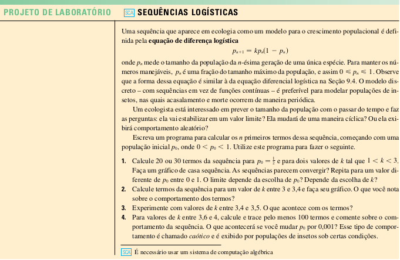

# Sequências Logísticas
## Resolução de problemas com a Equação de Diferença Logística
Este repositório é dedicado à versionar a implementação proposta no exercício prático de Projeto de Laboratório, presente no capítulo 11.1 de Sequências e Séries, do livro de Cálculo Vol. II - James Stewart.

## Atividade proposta:

